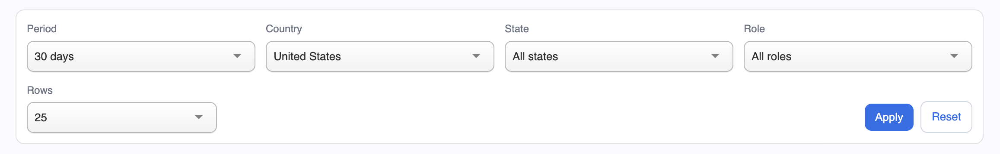
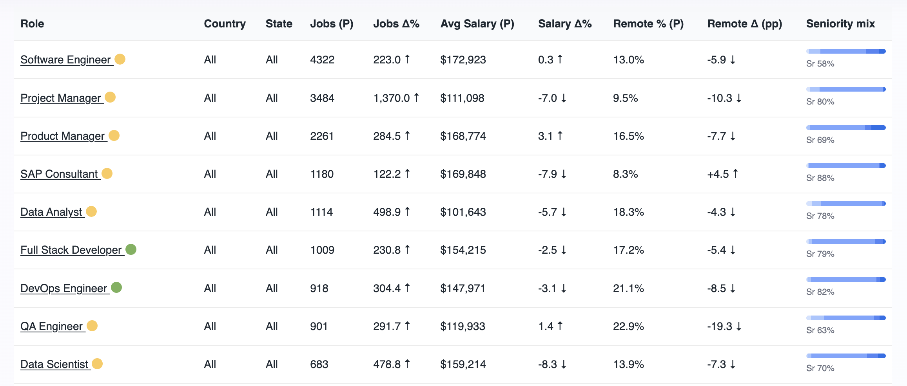
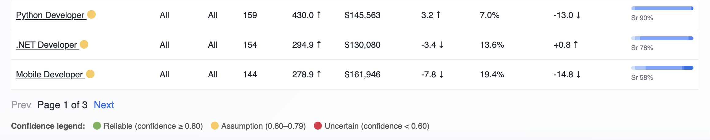
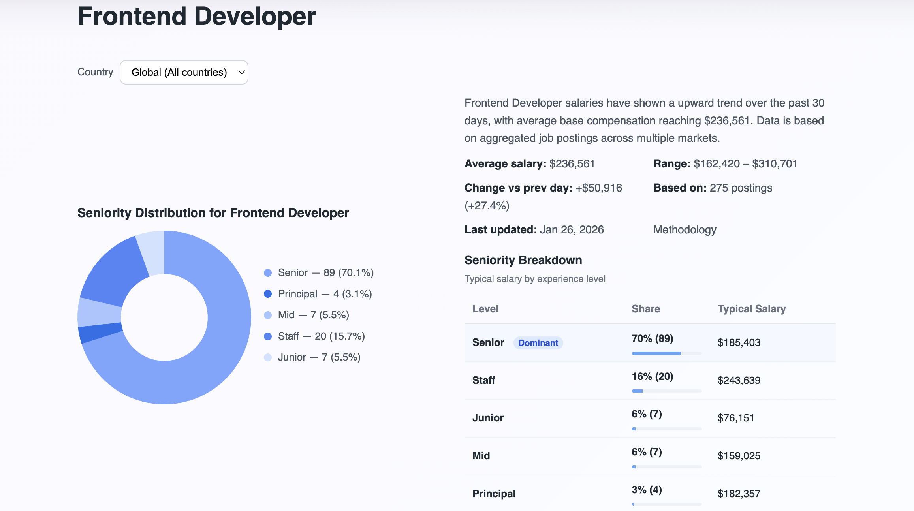
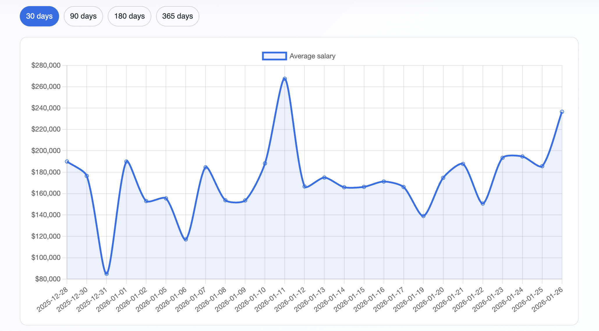

# ScanRole API

[](https://scanrole.com/api_terms/)

## Purpose
ScanRole API provides read-only labor market analytics for tech roles:
- job demand
- salary trends
- remote share
- growth dynamics

Designed for:
- dashboards
- research
- automation scripts
- external integrations

## Authentication
```
Authorization: Bearer <API_TOKEN>
```

How to obtain a token:
1) Register or log in on scanrole.com
2) Generate an API token in your user dashboard (**Add API Token**)

## Base URL
```
https://scanrole.com/api/v1
```

## Quick Start
1) Get your API token at https://scanrole.com
2) Call the API:

```bash
curl -H "Authorization: Bearer $TOKEN" \
  "https://scanrole.com/api/v1/role-explorer?period_days=30&country=US&page=1&page_size=25"
```

Response example:
```json
{
  "as_of_date": "...",
  "total": 59,
  "items": [ ... ]
}
```

## Endpoints
- `GET /api/v1/role-explorer`
- `GET /api/v1/meta/periods`
- `GET /api/v1/meta/countries`
- `GET /api/v1/meta/states?country=US`
- `GET /api/v1/meta/roles`
- `GET /api/v1/health`

## Core Endpoint
### GET /role-explorer
Returns aggregated metrics per role for the selected period and filters.

#### Query parameters
| Name | Type | Required | Description |
| --- | --- | --- | --- |
| period_days | int | no | 7, 30, or 90 (default: 30) |
| country | string | no | ISO-2 country code (US, CA, GB) |
| state | string | no | Optional region/state |
| role | string | no | Role name |
| sort_by | string | no | Sorting field (see below) |
| sort_dir | string | no | asc or desc (default: desc) |
| page | int | no | Page number (default: 1) |
| page_size | int | no | 10, 25, 50, or 100 (default: 25) |

#### Allowed sort_by values
- jobs_current
- jobs_delta_pct
- salary_current
- salary_delta_pct
- remote_current
- remote_delta_pp
- role
- country
- state

#### Response
```json
{
  "as_of_date": "2026-01-24",
  "total": 214,
  "items": [
    {
      "role": "Software Engineer",
      "country": "United States",
      "state": "CA",
      "jobs_current": 1200,
      "jobs_prev": 980,
      "jobs_delta_pct": 22.4,
      "jobs_trend": "up",
      "salary_current": 145000,
      "salary_prev": 138000,
      "salary_delta_pct": 5.1,
      "salary_trend": "up",
      "remote_current": 42.7,
      "remote_prev": 39.8,
      "remote_delta_pp": 2.9,
      "remote_trend": "up",
      "confidence_current": 0.78,
      "seniority_counts": {
        "Junior": 120,
        "Mid": 540,
        "Senior": 420,
        "Staff": 90,
        "Principal": 30
      }
    }
  ]
}
```

#### Notes
- `country` in the response is a full name (for example `United States`).
- Some numeric fields may be `null` when data is insufficient.

## Metadata Endpoints
### GET /meta/periods
```json
{ "items": [7, 30, 90] }
```

### GET /meta/countries
```json
{ "items": ["US", "CA", "GB"] }
```

### GET /meta/states?country=US
Returns states/regions for a given country.

### GET /meta/roles
Returns available role names.

## Health
### GET /health
```json
{ "status": "ok" }
```

## Error Format
```json
{
  "error": {
    "code": "UNAUTHORIZED",
    "message": "Invalid or expired token"
  }
}
```

## Examples
### Basic request
```bash
curl -H "Authorization: Bearer $TOKEN" \
  "https://scanrole.com/api/v1/role-explorer?period_days=30&country=US&page=1&page_size=25"
```




See live pages:
- Role Explorer: https://scanrole.com/role_explorer/

### Sorting
```bash
curl -H "Authorization: Bearer $TOKEN" \
  "https://scanrole.com/api/v1/role-explorer?sort_by=jobs_current&sort_dir=asc"
```

### Pagination
```bash
curl -H "Authorization: Bearer $TOKEN" \
  "https://scanrole.com/api/v1/role-explorer?page=2&page_size=50"
```

Role details (coming soon)



Role details (coming soon)



- Role detail example: https://scanrole.com/role/frontend-developer/

### Requirements
- Python 3.10+
- MySQL access to Role Explorer data table
